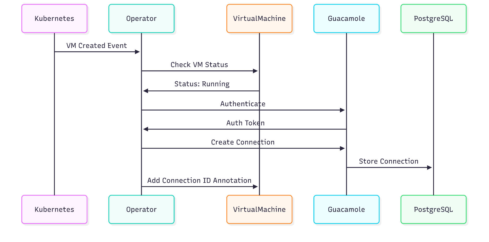

# KubeVirt Guacamole Operator

[](https://opensource.org/licenses/Apache-2.0)
[](https://golang.org)
[](https://kubernetes.io)

A Kubernetes operator that manages KubeVirt virtual machines with integrated Apache Guacamole remote desktop access, complete monitoring stack, and automated deployment workflows.

## Overview

This operator provides:

- **Integrated Remote Access**: Apache Guacamole web-based remote desktop access for VMs
- **Identity Management**: Keycloak integration for SSO and user authentication
- **Monitoring Stack**: Prometheus and Grafana for comprehensive monitoring
- **Container Registry**: Private Docker registry for custom images
- **Automated Workflows**: Scripts for easy deployment and management

## Architecture



## Table of Contents

- [Quick Start](#quick-start)
- [Prerequisites](#prerequisites)
- [Installation](#installation)
  - [Automated Setup](#automated-setup)
  - [Manual Setup](#manual-setup)
- [Configuration](#configuration)
- [Usage](#usage)
  - [Creating Virtual Machines](#creating-virtual-machines)
  - [Managing VMs](#managing-vms)
- [Access Points](#access-points)
- [Components](#components)
- [Monitoring](#monitoring)
- [Known Limitations](#known-limitations)
- [Contributing](#contributing)
- [License](#license)

## Quick Start

Deploy everything with a single command:

```bash
# Clone the repository
git clone <repository-url>
cd kubevirt-guacamole-operator

# Install prerequisites and complete automated deployment
./workflow.sh full-setup

# Create and configure VMs
./workflow.sh create-vm

# Check deployment status
./workflow.sh status

# View detected endpoints
./workflow.sh detect-ip
```

**What you get:**

- Complete prerequisites installation (Go, Docker, K3S, Ansible, SSH keys)
- KubeVirt virtual machines with web-based remote access
- Apache Guacamole for RDP/VNC connections
- Keycloak for identity management and SSO
- Private container registry for custom images
- Prometheus & Grafana monitoring stack
- Automatic IP detection and dynamic path configuration
- Automated VM creation and configuration with Ansible

## Prerequisites

The workflow script automatically installs all prerequisites, including:

### System Requirements

- **Ubuntu/Debian-based Linux** (tested on Ubuntu 20.04+)
- **sudo privileges** for package installation
- **Internet connection** for downloading packages and images

### Automatically Installed Components

- **K3S Kubernetes** - Lightweight Kubernetes distribution with kubectl
- **Docker** - Container runtime and image building
- **Go 1.21.5** - For building the operator
- **Ansible** - For automated VM configuration
- **SSH keys** - Required for VM access (kubevmkey)
- **System packages** - git, curl, wget, make, build-essential, jq

### Kubernetes Components (Auto-installed)

- **KubeVirt** - Virtual machine management
- **CDI** (Containerized Data Importer) - For VM disk image handling
- **Local Path Provisioner** - For persistent storage (included with K3S)

### Required Components

- **SSH key pair** - For VM access (kubevmkey is automatically set up)

> **Note**: All prerequisites including SSH keys are automatically installed by running `./workflow.sh install-prerequisites`.

## Installation

### Automated Setup

The easiest approach is using the complete workflow script:

```bash
# Clone the repository
git clone <repository-url>
cd kubevirt-guacamole-operator

# Complete setup (installs all dependencies and deploys everything)
./workflow.sh full-setup

# Monitor deployment progress
watch kubectl get pods --all-namespaces
```

**What this does:**

1. **Installs Prerequisites** - K3S, Docker, Go, Ansible, SSH keys, and required packages
2. **Detects IP and configures** - Automatically detects node IP and updates configurations
3. **Installs KubeVirt and CDI** - Sets up virtual machine management
4. **Configures container registry** - Sets up private Docker registry with insecure registry settings
5. **Builds and deploys operator** - Compiles, pushes, and deploys the KubeVirt operator
6. **Deploys Guacamole stack** - Sets up Guacamole, PostgreSQL, and Keycloak with dynamic paths
7. **Deploys monitoring** - Sets up Prometheus and Grafana for system monitoring

### Manual Setup

For more control or troubleshooting, follow these steps:

#### 1. Automatic IP Detection

First, configure your environment with the correct IP addresses:

```bash
# Detect current IP and show endpoints
./workflow.sh detect-ip
```

#### 2. Install Prerequisites

Install all required softwares:

```bash
./workflow.sh install-prerequisites
```

This installs: K3S (with kubectl), Docker, Go, Ansible, SSH keys (kubevmkey), and required system packages.

#### 3. Configure Environment

Update all configuration files with current IP and paths:

```bash
./workflow.sh update-configs
```

> These steps are **critical** - it must be done before deploying any components, otherwise they will be configured with incorrect IP addresses.

#### 4. Install Kubernetes Components

Install KubeVirt:

```bash
./workflow.sh setup-kubevirt
```

Install CDI (Containerized Data Importer):

```bash
./workflow.sh setup-cdi
```

#### 5. Deploy Application Components

```bash
# Deploy container registry
./workflow.sh setup-registry

# Build and push operator
./workflow.sh build-operator
./workflow.sh push-operator

# Deploy operator
./workflow.sh deploy

# Deploy Guacamole stack
./workflow.sh deploy-stack

# Deploy monitoring (optional)
./workflow.sh monitoring
```

#### 6. Configuring Keycloak Integration

After deployment, configure Keycloak to enable SSO with Guacamole:

**Step 1: Access Keycloak Admin Console**

**Step 2: Create a New Realm**

1. Click **"Create realm"** in the top-left dropdown
2. Set **Realm name**: `GuacamoleRealm`
3. Click **"Create"**

**Step 3: Configure Guacamole Client**

1. In the new realm, go to **Clients** → **Create client**
2. **Client ID**: `guacamole`
3. Click **"Next"**
4. **Authentication flow**: Check **"Implicit flow"**
5. Click **"Next"**

**Step 4: Configure Client URLs**
Replace `<node-ip>` with your actual node IP:

- **Root URL**: `http://<node-ip>:30080/guacamole/`
- **Home URL**: `http://<node-ip>:30080/guacamole/`
- **Valid redirect URIs**: `http://<node-ip>:30080/guacamole/*`
- **Web origins**: `http://<node-ip>:30080/guacamole/`

**Step 5: Create Users**

1. Go to **Users** → **Create new user**
2. Set **Username** (e.g., `testuser`)
3. Set **First name** and **Last name**
4. Click **"Create"**
5. Go to **Credentials** tab → **Set password**

**Step 6: Test SSO Login**

1. Logout from Guacamole
2. You should now see **"Login with OpenID Connect"** option
3. Click it to login via Keycloak with your created user

> **Note**: After SSO is configured, VM connections created by the operator will not be accessible to newly created user who logged-in via Keycloak. You need to manually assign permissions for specific connections (Setting->Connections) through the Guacamole admin interface .

## Configuration

### Automatic IP Detection

The project automatically detects your node IP address, eliminating the need for manual configuration when moving between different environments.

> **Important**: IP detection and configuration must be done **before** deploying any components. Components deployed with incorrect IP addresses will not function properly.

### Dynamic Path Resolution

The project now automatically handles path configurations, making it portable across different machines and user setups.

#### Manual Environment Configuration

If you need to override the automatic detection, you can source the environment file:

```bash
# Source environment configuration
source .env

# Or set specific variables
export NODE_IP=192.168.1.100
export REGISTRY_PORT=30500
```

### Environment Variables

The following environment variables are automatically detected and can be overridden:

| Variable          | Auto-Detected | Description                       |
| ----------------- | ------------- | --------------------------------- |
| `NODE_IP`         | ✓             | IP address of the Kubernetes node |
| `REGISTRY_PORT`   | 30500         | Port for the container registry   |
| `GUACAMOLE_PORT`  | 30080         | Port for Guacamole web interface  |
| `KEYCLOAK_PORT`   | 30081         | Port for Keycloak admin interface |
| `GRAFANA_PORT`    | 30300         | Port for Grafana dashboard        |
| `PROMETHEUS_PORT` | 30090         | Port for Prometheus metrics       |

## Usage

### Creating Virtual Machines

#### Automated VM Creation and Configuration

The easiest way to create and configure VMs is using the automated workflow:

```bash
# Creates VMs and automatically configure them with Ansible (SSH keys must be already set up via install-prerequisites)
./workflow.sh create-vm

# List available VMs
./workflow.sh list-vms

# Configure existing VMs
./workflow.sh configure-vms
```

**What `create-vm` does:**

1. Creates VMs from YAML files (`dv_ubuntu1.yml`, `vm1_pvc.yml`, `dv_ubuntu2.yml`, `vm2_pvc.yml`)
2. Waits for VMs to be ready and get IP addresses
3. Automatically discovers VM IPs and populates Ansible inventory
4. Runs Ansible playbook to configure VMs with:
   - System package updates
   - Essential tools (curl, wget, git, vim, htop, net-tools)
   - Executes `install_services.sh` if present in `/home/ubuntu/`
   - Creates completion marker at `/home/ubuntu/.vm-configured`

#### VM Configuration with Ansible

The project includes a simplified Ansible setup for post-deployment VM configuration:

**Components:**

- **`scripts/populate-inventory.sh`**: Discovers VM IPs and populates inventory
- **`ansible/inventory`**: Static inventory file with VM IPs and SSH settings
- **`ansible/configure-vms.yml`**: Playbook for VM configuration
- **`ansible/ansible.cfg`**: Ansible configuration for seamless VM access

**Manual usage:**

```bash
# Populate inventory with current VM IPs
./scripts/populate-inventory.sh

# Run Ansible playbook
cd ansible && ansible-playbook configure-vms.yml

# Or from project root
./workflow.sh configure-vms
```

**Ansible inventory example:**

```ini
[vms]
10.42.0.50
10.42.0.51

[vms:vars]
ansible_user=ubuntu
ansible_ssh_private_key_file=~/.ssh/kubevmkey
ansible_ssh_common_args=-o StrictHostKeyChecking=no -o UserKnownHostsFile=/dev/null
```

#### Manual VM Creation

For more control, you can create VMs manually:

1. **Deploy VM with Ubuntu Cloud Image:**

```bash
# Create DataVolume (downloads Ubuntu Cloud Image)
kubectl create -f virtualmachines/dv_ubuntu1.yml

# Create VirtualMachine
kubectl create -f virtualmachines/vm1_pvc.yml
```

2. **Monitor VM status:**

```bash
# Check VM status
kubectl get virtualmachine
kubectl get vmi

# Check VM launcher pods (these are the actual VM pods)
kubectl get pods -l kubevirt.io/domain

# Get VNC access info
kubectl get virtualmachine ubuntu1-vm -o yaml | grep -A 5 "guacamole"
```

3. **Access via Guacamole:**

- Navigate to `http://<node-ip>:30080/guacamole/`
- Login via Keycloak (admin/admin) or directly with Guacamole credentials
- VMs will appear automatically in the connection list

### Supported Protocols

The operator supports **RDP** and **VNC** protocols for remote access to VMs.

## Access Points

Once deployed, you can access the following services:

| Service         | URL                                 | Credentials         |
| --------------- | ----------------------------------- | ------------------- |
| **Guacamole**   | `http://<node-ip>:30080/guacamole/` | guacadmin/guacadmin |
| **Keycloak**    | `http://<node-ip>:30081/`           | admin/admin         |
| **Grafana**     | `http://<node-ip>:30300/`           | admin/admin         |
| **Prometheus**  | `http://<node-ip>:30090/`           | -                   |
| **Registry**    | `http://<node-ip>:30500/`           | -                   |
| **Registry UI** | `http://<node-ip>:30501/`           | -                   |

> **Note**: Replace `<node-ip>` with your actual node IP address. Use `./workflow.sh detect-ip` to see your current endpoints.

## Components

### Core Components

| Component      | Namespace                   | Purpose                        | Port        |
| -------------- | --------------------------- | ------------------------------ | ----------- |
| **Operator**   | `kubebuilderproject-system` | VM lifecycle management        | -           |
| **Guacamole**  | `guacamole`                 | Web-based remote desktop       | 30080       |
| **Keycloak**   | `guacamole`                 | Identity and access management | 30081       |
| **PostgreSQL** | `guacamole`                 | Database for Guacamole         | -           |
| **Registry**   | `docker-registry`           | Container image storage        | 30500/30501 |

### Monitoring Components

| Component         | Namespace    | Purpose               | Port  |
| ----------------- | ------------ | --------------------- | ----- |
| **Prometheus**    | `monitoring` | Metrics collection    | 30090 |
| **Grafana**       | `monitoring` | Metrics visualization | 30300 |
| **Node Exporter** | `monitoring` | Node metrics          | -     |

### Default Credentials

- **Keycloak**: admin / admin
- **Guacamole**: guacadmin / guacadmin
- **Grafana**: admin / admin

## Monitoring

The monitoring stack provides comprehensive observability:

### Prometheus Metrics

- **VM Resource Usage**: CPU, memory, disk I/O
- **Operator Metrics**: Reconciliation times, error rates
- **Cluster Metrics**: Node resources, pod status
- **Guacamole Metrics**: Active connections, session duration

### Grafana Dashboards

Import the dashboard file from `monitoring/dashboard/trafficcomparisondashboard.json`

Access dashboards at `http://<node-ip>:30300`:

1. **KubeVirt VMs Dashboard**: VM performance and status
2. **Operator Dashboard**: Operator health and metrics
3. **Cluster Overview**: Overall cluster health
4. **Guacamole Sessions**: Remote access session analytics

### Setting up Monitoring

```bash
# Deploy monitoring stack
./workflow.sh monitoring

# Check monitoring components
kubectl get pods -n monitoring

# Port forward for local access (optional)
kubectl port-forward -n monitoring svc/grafana 3000:3000
kubectl port-forward -n monitoring svc/prometheus 9090:9090
```

### Troubleshooting Commands

```bash
# Check overall system status
./workflow.sh status

# Check operator logs
kubectl logs -n kubebuilderproject-system deployment/kubebuilderproject-controller-manager -f

# Check VM status
kubectl get vm,vmi,dv,pvc

# List VMs and their IPs
./workflow.sh list-vms

# Reset everything if needed
./workflow.sh cleanup-all && ./workflow.sh full-setup
```

### Managing VMs

```bash
# Start VM
kubectl patch virtualmachine ubuntu1-vm --type merge -p '{"spec":{"running":true}}'

# Stop VM
kubectl patch virtualmachine ubuntu1-vm --type merge -p '{"spec":{"running":false}}'


# Check VM boot and SSH readiness
kubectl get vmi <vm-name> -o jsonpath='{.status.phase}'
kubectl get vmi <vm-name> -o jsonpath='{.status.interfaces[0].ipAddress}'

# Delete VM (IMPORTANT: Delete in correct order to clean up Guacamole connections)
kubectl delete virtualmachine ubuntu1-vm    # Delete VM first
kubectl delete datavolume ubuntu1-dv        # Then delete DataVolume
```

> **Important**: Always delete the VirtualMachine before deleting the DataVolume. The operator needs the VM object with its connection ID annotation to properly clean up the Guacamole connection.

### SSH Key Requirements

**Important**: The `kubevmkey` SSH key is **required** for VM access and is automatically set up during prerequisites installation:

```bash
# SSH keys are installed automatically during prerequisites
./workflow.sh install-prerequisites
```

The SSH keys are copied to `~/.ssh/kubevmkey` and `~/.ssh/kubevmkey.pub` and are **essential** for:

- VM SSH access
- Ansible configuration
- Administrative tasks on VMs

To manually verify SSH key setup:

```bash
# Check if SSH keys exist
ls -la ~/.ssh/kubevmkey*

# Test SSH connection to VM
ssh -i ~/.ssh/kubevmkey ubuntu@<vm-ip>
```

### VM and Ansible Troubleshooting

```bash
# Check VM connectivity
kubectl get vmi -o wide

# Test VM SSH connectivity (requires kubevmkey to be set up)
ssh -i ~/.ssh/kubevmkey ubuntu@<vm-ip>

# Check Ansible inventory
cat ansible/inventory

# Run Ansible in check mode (dry run)
cd ansible && ansible-playbook configure-vms.yml --check

# Run Ansible with verbose output
cd ansible && ansible-playbook configure-vms.yml -v

# Manually populate inventory and test
./scripts/populate-inventory.sh
cd ansible && ansible all -m ping

```

## Known Limitations

### Connection Sharing

- **Manual Group Assignment**: Auto-created Guacamole connections are only accessible by the admin user who created them
- **No Automatic Sharing**: Connections must be manually shared with users/groups through the Guacamole UI after creation
- **Scale Limitations**: Manual sharing becomes burdensome with many VMs and users
- **Admin Dependency**: Each new VM connection requires administrator intervention for user access

### Workaround

After a VM connection is automatically created:

1. Login to Guacamole as admin
2. Navigate to Settings → Connections
3. Select the auto-created connection
4. Click "Permissions" tab
5. Manually add users or groups with appropriate permissions
